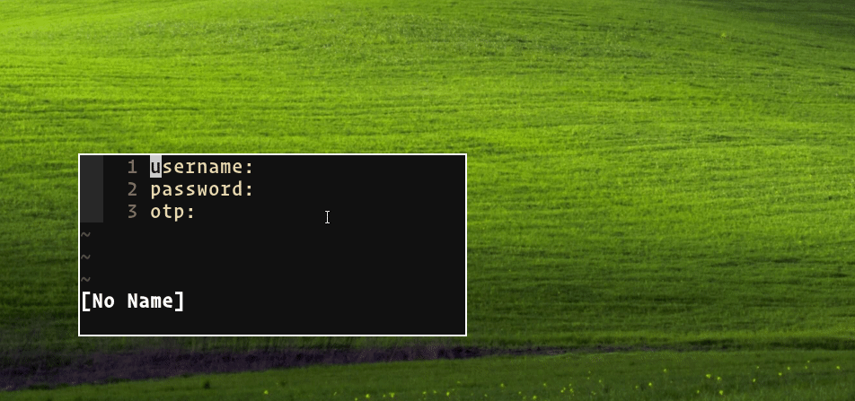

# Passmenu Fields 🌱

_Passmenu Fields is an extention for the [pass](https://www.passwordstore.org/) password manager._<br /><br />
It displays your pass files in dmenu, including a click-through menu for sub-fields, and copies the contents to the clipboard, providing a fast and convenient way of using credentials saved within pass.



## Prerequisites

- xclip
- dmenu
- pass

## Setup

- add the `passmenu-fields` executable to your $PATH (and optionally configure it to execute with a keyboard shortcut)
- make sure your gpg files are ordered + structured like this:

```gpg
mysecretpassword
username=myusername
otpauth://totp/...
```

## Todo

- [ ] Allow for more flexible file structure
- [ ] Make fields dynamic based on fields available in gpg file
